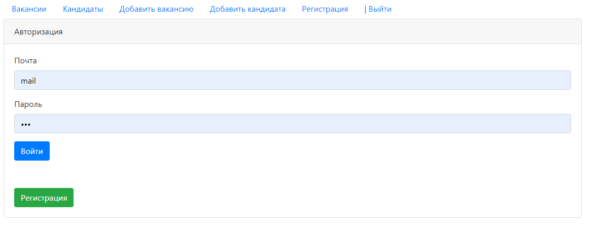

# job4j_dreamjob

#Функционал
* Регистрация пользователя
* Аутентификация на сервлет-фильтрах
* Авторизация через БД PostgreSQL
* Добавление/изменение вакансий
* Добавление/изменение соискателей
* Добавление/изменение/скачивание фотографии соискателя
* Две молдели хранения данных MemStore PsqlStore

# Технологии
* Java14

* JDBC

* PostgreSQL

* Servlet&JSP&JSTL

* HTML, CSS, BOOTSTRAP, JS, AJAX, JQUERY

* Apache Tomcat Server

* Junit, Mockito, Powermock

* Log4j

* Apache Commons Fileupload
## Регистрация 

## Авторизация

## Просмотр всех вакансий

## Просмотр всех кандидатов

## Добавление вакансии

## Добавление кандидата 
